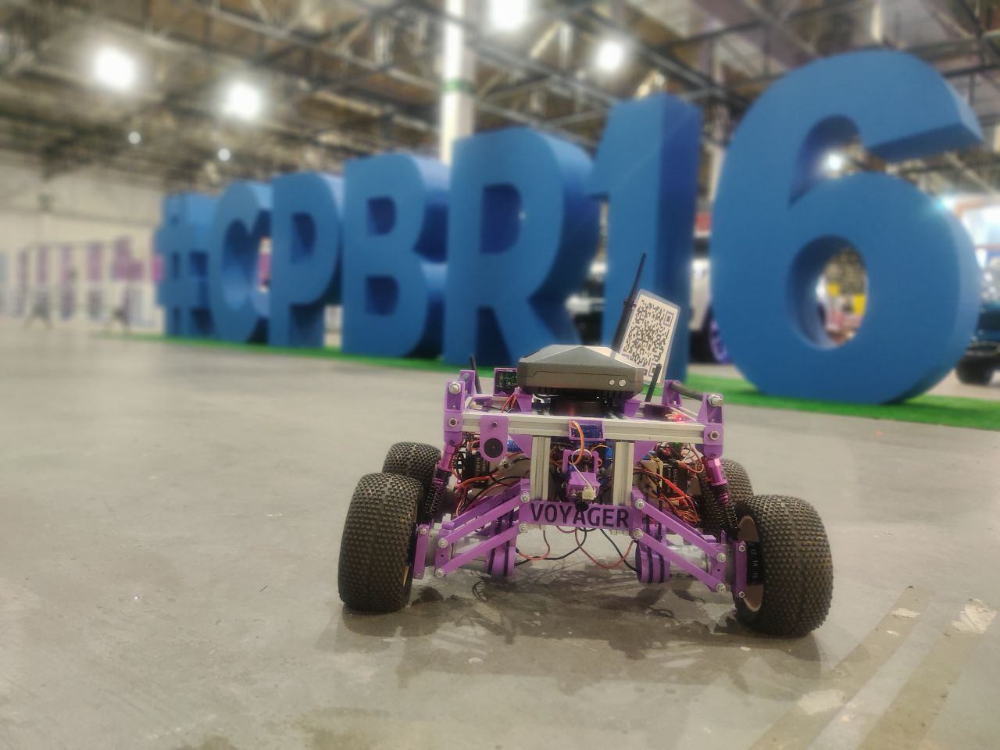

# Trekking project
Desenvolvimento de um robô rádio-controlado/autônomo da moralidade “trekking”

Nos arquivos [anteriores-descontinuados](./anteriores-descontinuados/) e nos demais arquivos deste repositório podem conter os termos `rv1` e `rv2` eles estão referindo a versões anteriores do robô sendo `Robô versão 1` `Robô versão 2`.

 

Apresentações anteriores relaionadas:
 * [**#CPBR16** - Trabalhando com Unidades de medidas Inerciais (IMU) ](https://garoa.net.br/wiki/Dumont_Hackerspace_na_Campus_Party_2024)
 * [ **#CPBR15** - Construindo um Robô Trekking - versão 2.0](https://www.youtube.com/watch?v=lGhopql1V54)
 * [ **#CPBR14** - Construção de um robo rádio controlado](https://www.youtube.com/watch?v=8P9nPsCdVAc)
 

     

### **Robô versão 3**:

 

### **Robô versão 2**: 

 

### **Robô versão 1**: 

