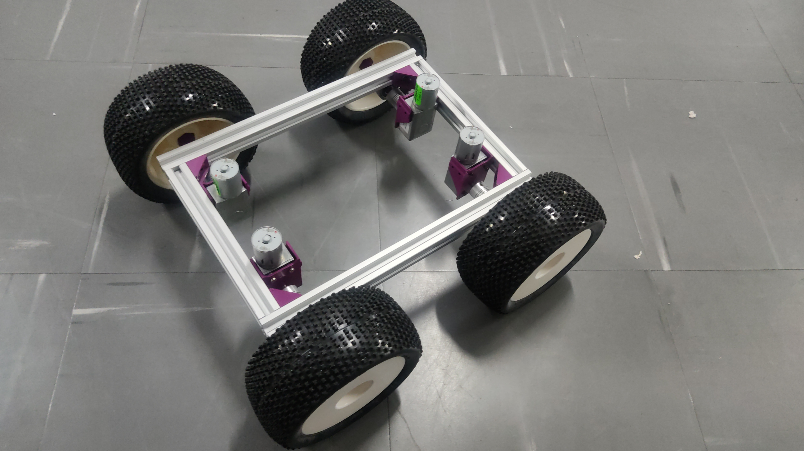
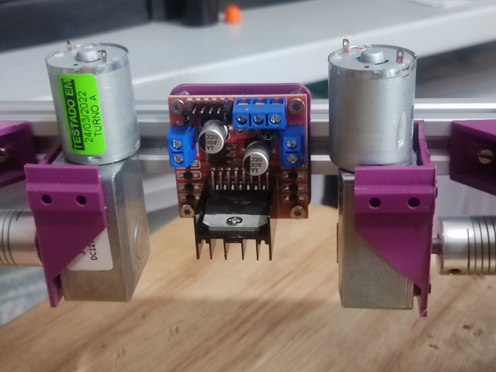
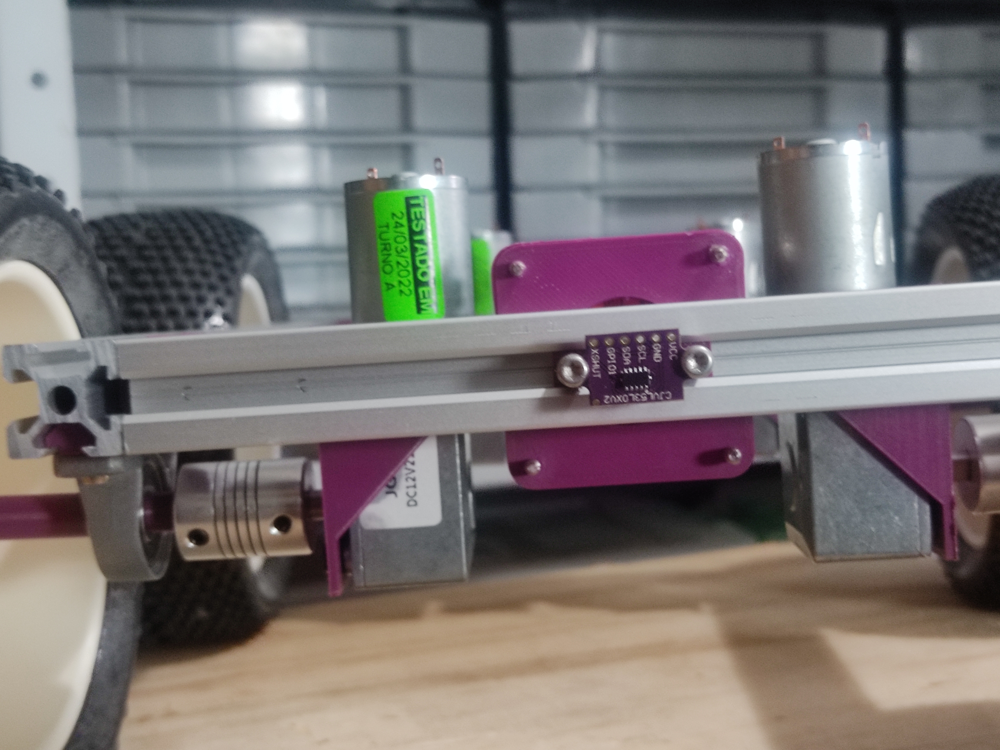

# tracker project
Desenvolvimento de um robô rádio-controlado/autônomo da moralidade “tracker”

 

## *Materiais Básicos*

Peças		         	| Descrição
:---------------------- | :-------------------------------------
Acoplamento D19 L25     | Acoplamento de eixo de 8mm para 6mm
Mancal Kp08             | Mancal com rolamento para eixo/fuso de 8mm
perfil v-slot 20x20     | Perfil estrutural de alumínio v-slot de 20mm x 20mm
Motor JGY               | Micro motor 12V; 210 rpm; 2kgm.cm; 6 mA à 2A
Roda  5.9"              | Roda  The X LPR Hong Nor de 5.9" x 2.68"
Barra Roscada M4        | 1000mm de barra coscada M4
Parafusos M3            | Parafusos M3 tipo torque de 10mm de comprimento 
Parafusos M3            | Parafusos M3 tipo torque de 5mm de comprimento
Porcas M3               | Porcas M3

  

### *Imagens*

