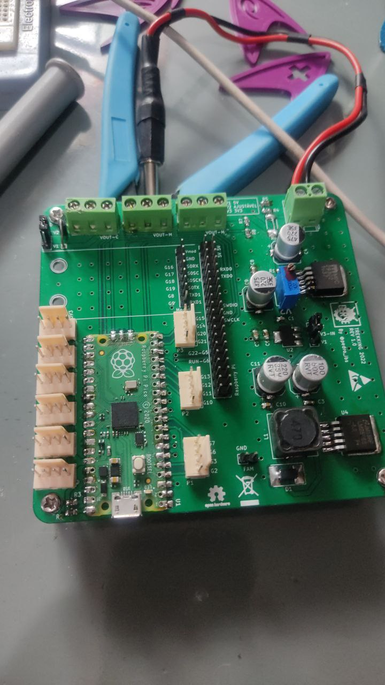

# **CIRCUITO: RASP-RPIOICO**

 

### *Descrição*

Circuito de controle/driver dos motores, módulos. Faz uso da raspberry pi pico para trabalho em conjunto com a Raspberry pi. Contém um conjunto de fontes DC-DC, linear para trabalhar com os drivers e módulos. 

 

 