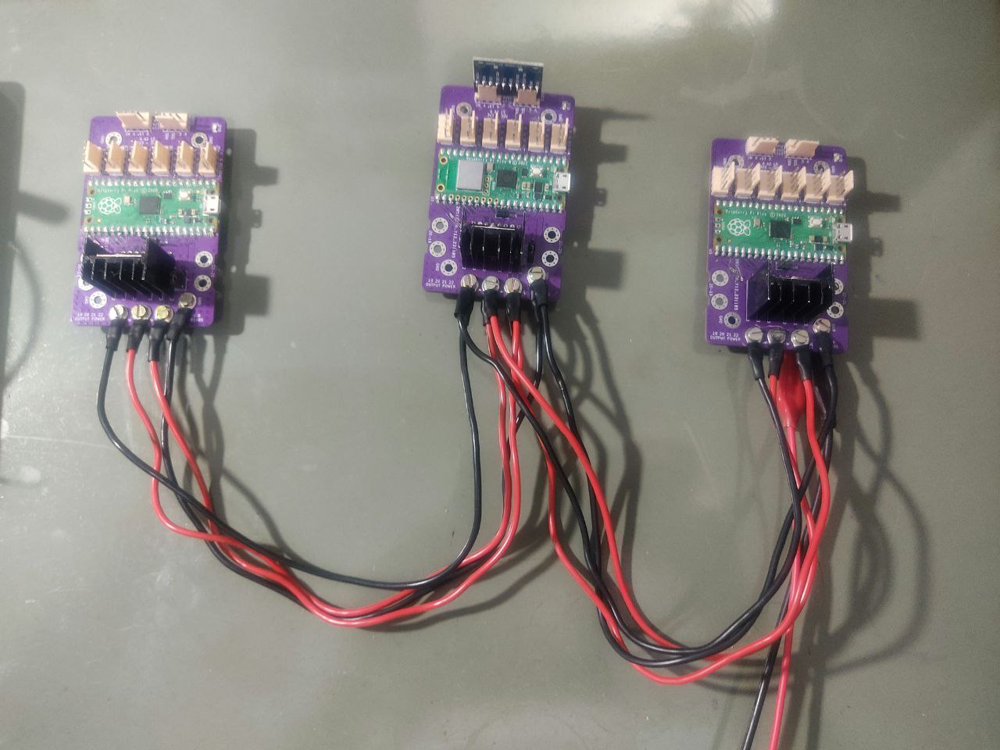

# **PECDR** - **P**lataforma **E**letrónica de **C**ontrole **D**istribuído em **R**ede 

A proposta deste circuito é distribuir o controle em subsistemas utilizando rede sem fio ou por meio da comunicação RS485. Conta com a `raspberry pi pico` modelo comum ou `W`. e diversos periféricos possibilitando atuar em trabalhos variados.

### **Elementos**:
 * O circuito embarca uma `raspberry pi pico` modelo comum ou `W`;
 * Uma fonte dc-dc buck step down 3V3 3A;
 * Driver de potência  L298N (com seleção de tensão de operação entre VCC e 3V3);
 * Interface de comunicação RS485;
 * Disponibiliza GPIOS para uso geral; 
 * Expansão para o MPU9250/6500;

 

