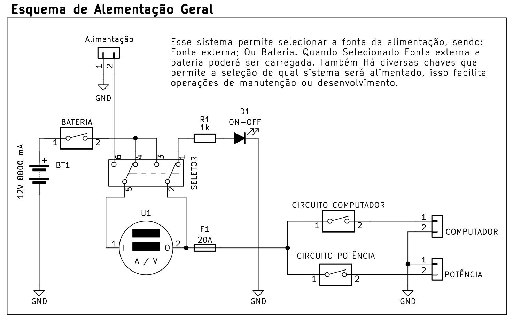
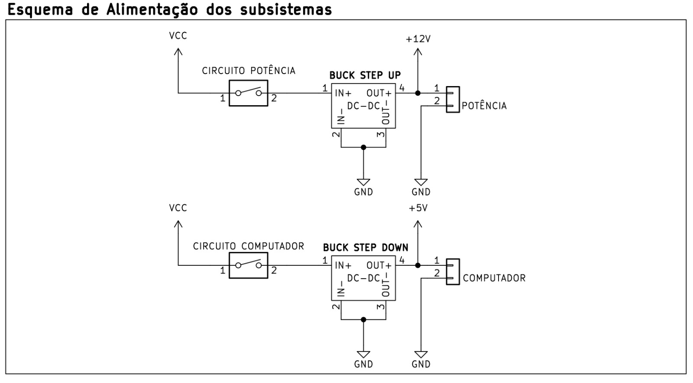
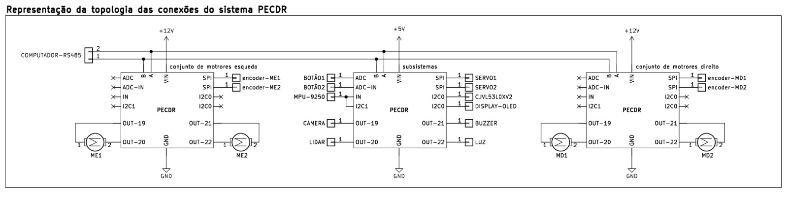

# **ESQUEMA GERAL DA ALIMENTAÇÃO E CONEXÇÕES DO ROBÔ**

 

### **ALIMENTAÇÃO GERAL**
A chave `SELETOR` muda a origem da alimentação, sendo ela a bateria ou fonte externa, no modelo externo combinado com a chave da `BATERIA` permite que o robô opere usando uma fonte externa carregando ou não a bateria. Em Ambos os casos o multímetro amperímetro irá medir a fonte de origem selecionada pelo `SELETOR`. Também com as chaves `CIRCUITO COMUTADOR` e `CIRCUITO POTÊNCIA` permite ligar ou desligar um sistema independentemente do outro. Essas opções existem para facilitar o desenvolvimento e manutenção do robô

 

   

### **ALIMENTAÇÃO DOS SUBSISTEMAS**
Para o Robô a linha de `POTÊNCIA` é considerada a de 12V, que irá alimentar os motores e atuadores que demandam uma corrente elevada. Já a linha `COMPUTADOR` é responsável por alimentar o sistema de controle principal e alguns subsistemas.

 

   

### **ALIMENTAÇÃO DOS SUBSISTEMAS**
O robô contém alguns subsistemas, dois reservados para controlar os conjuntos de motores esquerdos e direitos, e um responsável pelo controle de ativação e controle ativo sensores e atuadores, também faz a aquisição de alguns sensores.

 

   
